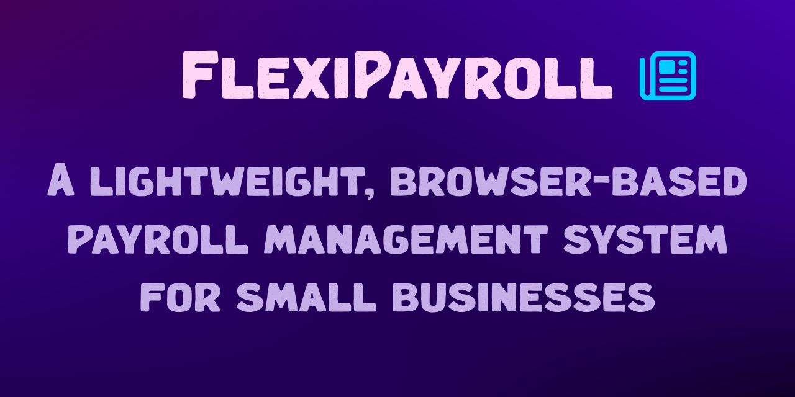

<div align="center">
  
  <h1>FlexiPayroll</h1>
  <p>Local-first payroll management for small businesses</p>
  
</div>

---

FlexiPayroll calculates monthly payroll from attendance, business rules, and employee adjustments. It runs entirely in the browser, stores data in `localStorage`, and needs no account or backend.

## Features

- Employee records, salaries, and probation status
- Entry and exit time tracking
- Workday, holiday, paid-leave, and unpaid-leave records
- Configurable bonuses, deductions, and eligibility rules
- Per-employee payroll adjustments
- Detailed printable salary reports
- JSON backup and restore
- Light and dark themes
- Installable PWA with offline support

## Quick Start

Requires Node.js 18 or newer and npm.

```bash
npm ci
npm run dev
```

Open `http://localhost:5173` in your browser.

## Commands

| Command | Purpose |
| --- | --- |
| `npm run dev` | Start the Vite development server |
| `npm test` | Run payroll, print, backup, and dialog tests |
| `npm run build` | Build for deployment under `/flexipayroll/` |
| `npm run build:offline` | Build with relative asset paths |
| `npm run preview` | Preview the production build |

Vite writes build output to `dist/`.

## Payroll Workflow

1. Configure the pay period, working days, and payroll rules.
2. Add employees and monthly salaries.
3. Record attendance and leave.
4. Apply employee-specific adjustments.
5. Review and print salary reports.

## Data Storage

The browser stores data under the current profile and site origin. Clearing site data removes it. Export a backup before clearing browser data or moving to another device.

## Stack

Svelte 5, Vite 6, Sass, and `vite-plugin-pwa`.

## License

[AGPL-3.0](LICENSE)